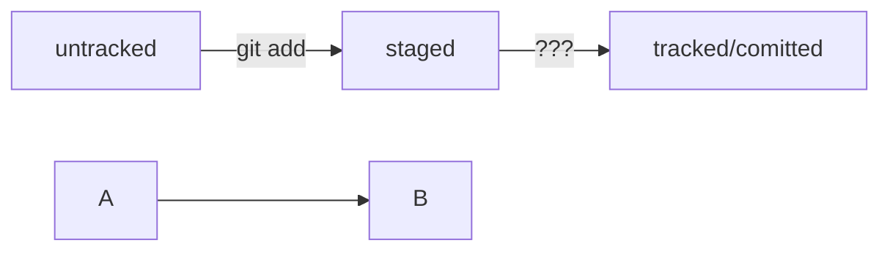

# Создание репозитория GIT

<b>Основные команды:</b>
<ul>
<li>Создание локального репозитория: git init</li>
<li>Проверка статуса git status</li>
<li>Добавление файлов git add .</li>
<li>Зафиксировать изменения git commit -m 'текст коммита'</li>
<li>Привязка локального репозитория к удаленному на github: git remote add origin <SSH-key></li>
<li>Убедимся что репозитории привязаны git remote -v</li>
<li>Первая синхронизация git push -u origin master. Усли появится ошибка заменить master на main</li>
<li>Файл HEAD (англ. «голова», «головной») — один из служебных файлов папки .git. Он указывает на коммит, который сделан последним (то есть на самый новый). Внутри HEAD — ссылка на служебный файл: refs/heads/master (или refs/heads/main в зависимости от названия ветки). Если заглянуть в этот файл, можно увидеть хеш последнего коммита.</li>
</ul>
<b>Статусы фалов:</b>
